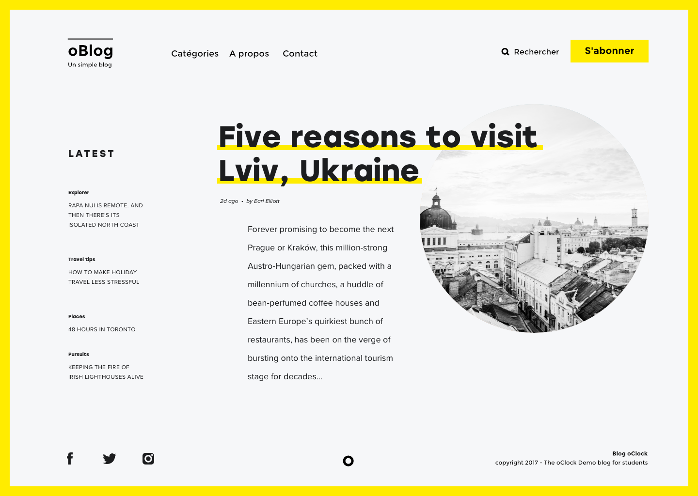

# Atelier oBlog

Vous devez réaliser cette intégration en mettant en place Brunch et en travaillant avec une architecture SCSS s'appuyant sur le `pattern 7-1` vu dans `sass-guidelin.es`

## Infos

- La font utilisée est la Montserrat (disponible sur Google Fonts)
- Font-awesome contient tous les icones nécessaires